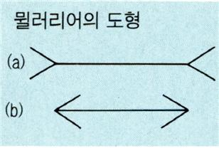

#### 돈에 관한 생각

돈에 관한 생각은 누구나 가지고 있을것이다. 
적어도 매일 우리는 공기를 마시듯 돈을 사용하고 있다.  
내가 점유하는 이공간 마저 건설업자가 땅을 구매하고  
아파트를 건설하고 내가 돈으로 교환한 것이다. 
매일 우리는 돈으로 전기와 음식을 소비한다. 
이것들은 근본적으로 자연으로 부터 생산 된것이다. 

우리의 행동을 지배하는 점화효과

돈을 상기시키는 점화효화 - high, a , salary , dexk, paying

돈에서 점화된 피험자들은 다른 것으로 점화된 사람들보다 훨씬 더 
독립적으로 변했다. 그들은 실험자에게 도움을 구하기 전에 매우  
까다로운 문제를 해결하기 위해 거의 두 배 가까운 시간을 더 노력했다.

돈에 개한 생각이 개인주의, 즉 타인에게 의존하거나, 간섭하거나  
그들의 요구를 수용하기를 꺼려하는 개인주의를 점화시킨다는 점이다.

몰래 그의 험담을 하는 자신을 생각만 했는데도 마트에서  
배터리나 주스, 아이스크림보다는 비누나 소독약, 세제를  
구해하는 경행을 보였다, 자신의 영혼이 더럽혀졌다는 느낌은  
자신의 몸을 씻고 싶다는 욕구를 유발하는 듯하다. 
"맥베스 부인효과 (Lady Macbeth effect)"

추정되는 레이디 맥베스 효과 또는 맥베스 효과 A는 프라이밍 효과 (A)에 응답하여  발생하는 경우, 상기 세정 큐의 감각에 의해 유도 된 후 증가 수치 . [1] 이 효과는  셰익스피어 연극 맥베스 ( Macbeth) 의 레이디 맥베드 (Lady Macbeth) 캐릭터의  이름을 따서 명명되었습니다. 
그녀는 살인을 저 지른 후에 그녀의 손에 피가 묻은 것을 상상 했다. 

한 실험에서 여러 참가자 그룹이 선행이나 악행 과거를 기억하도록 요청한 후  
"W_ _H", "SH_ _ER"및 "S_ _P"라는 3 개의 불완전한 단어를 작성하도록 요청 받았습니다.  악의적 인 행동을 회상하도록 요청 받았던 사람들은 "wish",  "shaker"또는 "stop"과 같은 대안 대신 "wash", "shower"및 "soap"과 같은 
클렌징 관련 단어로 응답하는 경향이 약 60 % 더 높습니다 ".  
- 위키피디아 -  

기하학적 착시도형(錯視圖形)에서 가장 널리 알려진 것으로 
1889년 독일의 사회학자이자 심리학자인 F. 뮐러리어에 의해 고안되었다.

같은 길이의 두 직선이지만 하나는 양쪽 끝의 화살표시를 안으로 향하게 하고  
또 하나는 바깥쪽으로 향하게 그린 도형이다. 
안으로 향하게 한 [그림 a]익 직선은 길게 보이고,  
밖으로 향하게 한 [그림 b]의 직선은 짧게 보이는 착각을 일으킨다. 

